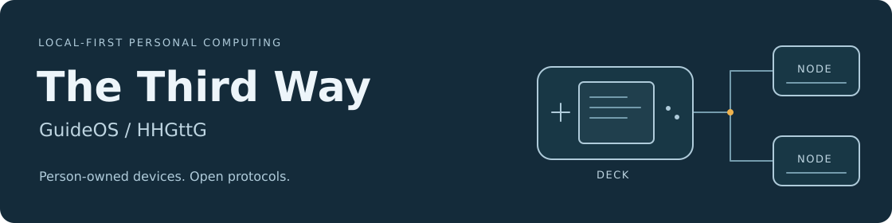

# The Third Way

An experimental personal computing project built around devices and services
that the person using them controls. **GuideOS** is the Linux environment for a
portable **Deck**. **HHGttG** is the architecture and protocol work that connects
Decks, nearby **Nodes**, and optional interpretation services.

The current hardware target is the **Anbernic RG35XX H**, using minimal Debian
ARM64. The source includes a controller-driven interface, media playback,
Notepad, storage and connectivity providers, and a Windows Node interface.

**Development status:** source and documentation are available here. A public
installable image and a complete build of the working Deck image are still in
preparation. See the [handbook](docs/HANDBOOK.md#current-status) for component
status and the limits of the available builds.

## Start here

| I want to… | Read |
| --- | --- |
| Understand the project | [Project handbook](docs/HANDBOOK.md) · [Plain-text edition](docs/HANDBOOK.txt) |
| Find a specification or component | [Documentation](docs/README.md) · [Complete catalogue](docs/CATALOG.md) |
| Explore the Deck implementation | [GuideOS](GuideOS/README.md) |
| Run the Windows Node interface | [NDI setup and source](GuideOS/node/desktop/README.md) |
| Work on the code or documentation | [Development guide](docs/DEVELOPMENT.md) |

## Project principles

- Useful local operation without a mandatory cloud account.
- Open interfaces and portable information.
- Permissions enforced by the system and controlled by the owner.
- Clear interfaces that work with modest hardware.
- Interoperation that respects the people on both sides of a connection.

The [project definition](HHG_Foundation/02_GUIDE_AND_PROTOTYPE_DEFINITION.txt)
and [design philosophy](HHG_Foundation/03_DESIGN_PHILOSOPHY.txt) contain the
full foundations. The handbook explains the terminology and prototype scenarios.

## Repository layout

| Path | Contents |
| --- | --- |
| [GuideOS/](GuideOS/) | Deck source, providers, board integration and contracts |
| [HHG_Foundation/](HHG_Foundation/) | Project definition and design principles |
| [prototypes/](prototypes/) | Desktop continuity, viewing and event experiments |
| [docs/](docs/) | Handbook, development guidance and documentation catalogue |
| [tools/repository/](tools/repository/) | Source-publication and documentation checks |

## Contributing and licensing

Use [CONTRIBUTING.md](CONTRIBUTING.md) to get started. Documentation is maintained
in UTF-8 Markdown or plain text; diagrams and reference images supplement it.

Original software is **AGPL-3.0-or-later**. Original documentation and visual
material are **CC-BY-SA-4.0**. Third-party material retains its own notices.
See [LICENSE.md](LICENSE.md) for the full policy.
